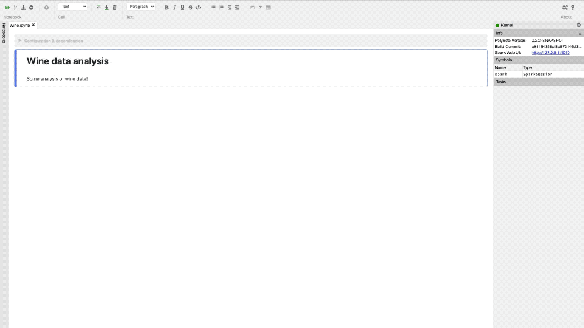
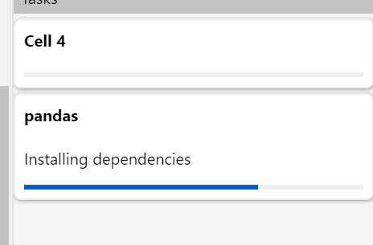
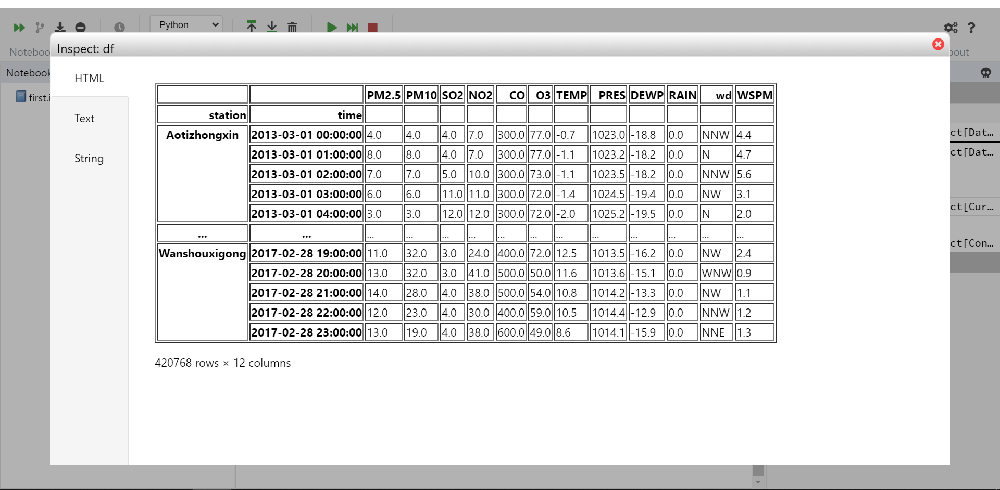
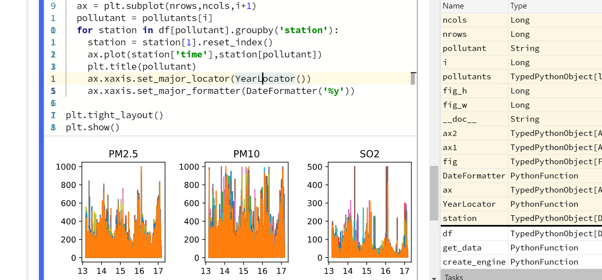

# Exploring Polynote 

*10/30/2019* | Alex Michael

<div style='text-align: center;'>

</div>


<br/>[Polynote](https://medium.com/netflix-techblog/open-sourcing-polynote-an-ide-inspired-polyglot-notebook-7f929d3f447) \([HN](https://news.ycombinator.com/item?id=21337260)\), open-sourced by Netflix this week, is being called the Jupyter Notebook killer.  This is a really high bar, because I think Jupyter Notebook is an awesome and creative piece of technology (respect to the developers) but maybe with the release of Polynote, the notebook ecosystem will get even better.  The key features of Polynote that make it potentially so good are that:
1. __It is a ployglot:__ it supports Scala as a first-class language (alongside Python and SQL).
1. __Polynote acts like an IDE:__ Some of my favorites include like visualizing state, visualizing of data without cluttering the notebook (using matplotlib integration), and text editing features like autocompletion and error highlighting.

Alot of the features that are really impressive about Polynote seem to come from actual use at Netflix so I am very confident that this software will be useful!  You can read more about Polynote in this [article](https://towardsdatascience.com/what-you-need-to-know-about-netflixs-jupyter-killer-polynote-dbe7106145f5?source=friends_link&sk=33e35e44208b1570f3c7fa31a36f4d0a) from Towards Data Science.

<div style='text-align: center;'>
    <br />
    
    <p><i>Looks pretty sweet!</i></p>
</div>

## Installation

While the installation, isn't super interesting, I hope that I can save someone a bit of the chagrin of installing this.  Installation was bit of a pain, it wasn't an easy one-line installation process like Jupyter, hopefully this will improve as the software matures.  Also, it isn't yet possible to use Polynote on Windows, only Mac and Linux.  I am installing on Debian 10, so the steps here will focus on that process.  I am more or less following the [Polynote installation guide](https://polynote.org/docs/01-installation.html) on the Polynote website, so this section may be redundant. 

1. __Download and install Polynote:__ follow the instructions [here](https://polynote.org/docs/01-installation.html) under Download
1. __Install Java:__ Polynote requires Java 8 as of release 0.2.8, which can be installed in one of two ways:
    1. __Add via apt-get package repository (recommended):__
	* Add `deb http://ftp.us.debian.org/debian sid main` to `/etc/apt/sources.list`.  This adds the packages which can be found in Debian Sid's package repository to apt-get's list of available packages.    

    ```bash
    sudo apt-get update
    sudo apt-get install openjdk-8-jdk
    sudo update-alternatives --config java

    export JAVA_HOME=/usr/lib/jvm/java-8-openjdk-amd64
    export PATH=$PATH:$JAVA_HOME/bin
    ```

    1. __Add the JDK Manually__
    * Polynote requires Java 8, which is not in the Debian package repository, which mean you have to install it manually.  The Java 8 JDK can be found [here](https://jdk.java.net/java-se-ri/8), pick the appropriate archive and download it (downloading from the main Oracle site means you have to sign in and go through a whole painful process).

    ```bash
    wget https://download.java.net/openjdk/jdk8u40/ri/jdk_ri-8u40-b25-linux-x64-10_feb_2015.tar.gz
    sudo mkdir /usr/lib/jvm

    INSTALL_DIR=/usr/lib/jvm/

    # move Java 8 jdk to default installation location
    tar -xvzf jdk_ri-8u40-b25-linux-x64-10_feb_2015.tar.gz
    rm jdk_ri-8u40-b25-linux-x64-10_feb_2015.tar.gz
    sudo mv java-se-8u40-ri $INSTALL_DIR

    # set environment variables (include these lines in ~/.bashrc)
    export JAVA_HOME=/usr/lib/jvm/java-se-8u40-ri
    export PATH=$JAVA_HOME/bin:$PATH
    ```
1. __Download and install Spark__ (optional):
    * Spark Downloads and configurations are available [here](https://spark.apache.org/downloads.html).

    ```bash
    # Get Spark from the mirror (example)
    wget http://apache.claz.org/spark/spark-2.4.4/spark-2.4.4-bin-hadoop2.7.tgz

    # extract & install
    tar -xvzf spark-2.4.4-bin-hadoop2.7.tgz
    rm spark-2.4.4-bin-hadoop2.7.tgz
    mv spark* spark
    sudo mv spark /usr/local/

    # add spark to environment (include these lines in ~/.bashrc)
    export SPARK_HOME=/usr/local/spark/
    export PYSPARK_PYTHON=python3
    export PATH=$PATH:$SPARK_HOME/bin:$SPARK_HOME/sbin
    ```

1. __Install recommended Python packages__
    ```pip3 install pip3 install jep jedi pyspark virtualenv```

1. Add polynote to your bash config: add `alias polynote="$HOME/polynote/polynote/"` to your `~/.bashrc` or `~/.bash_aliases` file.

One of the major problems that I encountered with installing Java was with competing installations on my machine.  The reason why Polynote uses Java 8 is that this is the recommended Java release by Scala.  It seems that the errors resulting from using later versions of Java been resolved in [Issue #530](https://github.com/polynote/polynote/issues/530), but I didn't try that out.  Since I don't really use Java or Scala that much, I just uninstalled the competing installation, however for some folks this might not be an option, so running Polynote in a docker image might be the best way to go.

After the minor headache of installing Polynote, trying to get it to run.  Once I got Polynote up and runing, it kept throwing off errors so I had to spend a lot of time debugging, referring to Github issues.  Each of the errors I encountered were the result of improper installation (i.e. user error), but they still took quite a bit of time to sort out.  Once the big errors were worked out, a few of the 'fibers' were still logging errors, and I was still getting an error here and there from jep, but mostly the errors seemed to be harmless.

## Working with the Beijing Multi-Site Air-Quality Dataset


<div style='text-align: center; float: right; padding: 0 0 10px 50px'>
    <br />
    
</div>

Once I was able to start the server, the next challenge was to start loading some data in to mess with.  From all indications, Polynote doesn't really like to deal with local files the same way that Jupyter does; the *modus operandi* seems to be to load in all data from Spark. This makes a lot of sense given that the folks over at Netflix probably aren't doing much local storage.  To get around this limitation, and since I don't want to stand up a spark clustor or RDBMS based data store, I will just process the CSV files locally then pass the data in a PostgreSQL database, then pull it into memory in the notebook.

My first impression when working in Polynote is that it is a really good editing environment, it is a pleasure to edit in, it has some minor bugs in its user interface, but otherwise amazing!  I only ran into some minor trouble with jep (something about interpreter change, just took a simple restart).

One of the things that Polynote can do that amazed me is that you can run code out of order.  If you have modified the state of your notebook, you can still go back in and add code and it works!  In Jupyter, you would have to run the whole notebook over again.

<div style='text-align: center;'>
    <br />
    
    <p><i>You can view your data with a single click!</i></p>
</div>

<div style='text-align: center;'>
    <br />
    
    <p><i>Polynote's workflow is really nice</i></p>
</div>

I didn't take the workflow all the way to conclusion, since I am relatively inexperienced with data science that would take a while, but I will likely continue to explore this dataset the post the notebook and some results here later.

## Wish list

I love Polynote so far and the team has made lots of progress even in the last week! In order to see myself using this longterm, what I'd love to see are the following:

* __Out of the box stable installation:__ I managed to break so many things while installing this.
* __Ability to add tables or render markdown in notebooks:__ Markdown is one of my favorite things about Jupyter so it would be cool to have that here too, although the text editing is quite sophisticated.
* __SQL Interpreter for Postgres, MySQL, SQLite etc...:__ I would love to just go in the notebook configuration and add some parameters for SQL configuration like a flat file location or credentials for a database.  However, I understand this is a decent technical challenge and may be far off.
* __Take the time concept all the way:__ the state of the notebook over time is still not exactly perfectly maintained, i.e. rerunning a cell will pollute the state, I would love if the notebook followed an exact timeline and code could be run at any state.  I get that this would create branches, but I think that could be addressed later on.

## Conclusion

Getting Polynote up and running was a bit painful but once I finally was able to get it working and work through some example code, I was amazed with its quality and the thought that went into it.  This software is an incredibly clean implementation of a brilliant concept.

Polynote has a lot of the features that I really wanted in Jupyter and in terms of data visualization, it acts a lot like a generalization of RStudio for large scale data-science.  Polynote is somewhat opinionated and big-data oriented, which is to be expected from a large consumer-facing tech company like Netflix.  Once a few of the rough edges are smoothed out, I think Polynote truly will be able to give Jupyter a run for its money with the consumer market.  I hope to be able to contribute and I hope polynote will continue to get support from Netflix and the open-source community!  Huge ups to the developers, you guys did an amazing job with this!